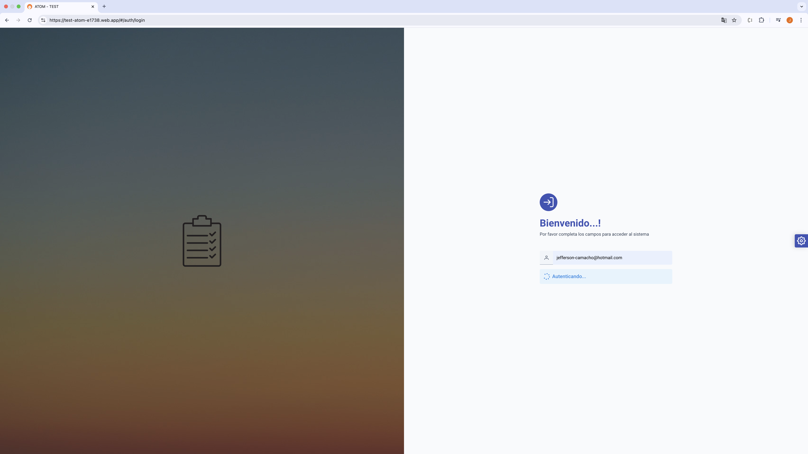
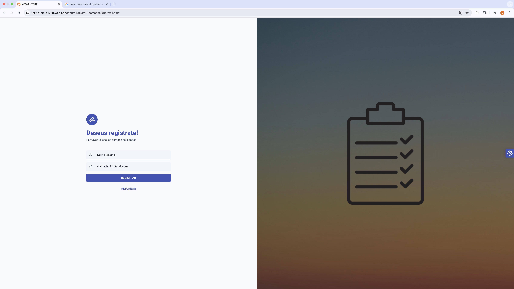
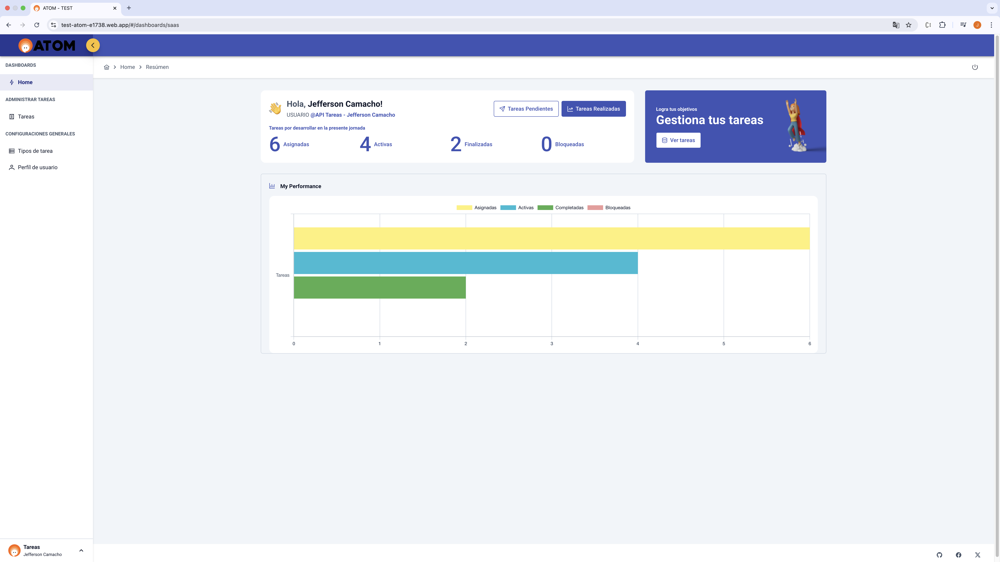
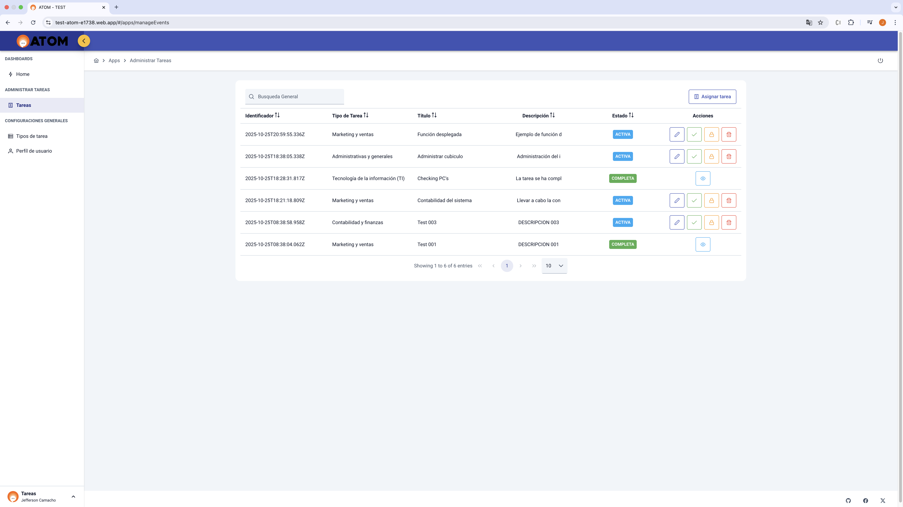
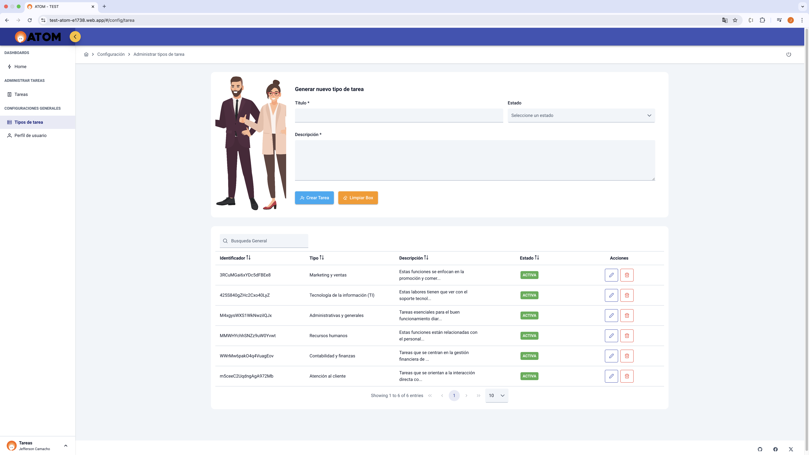
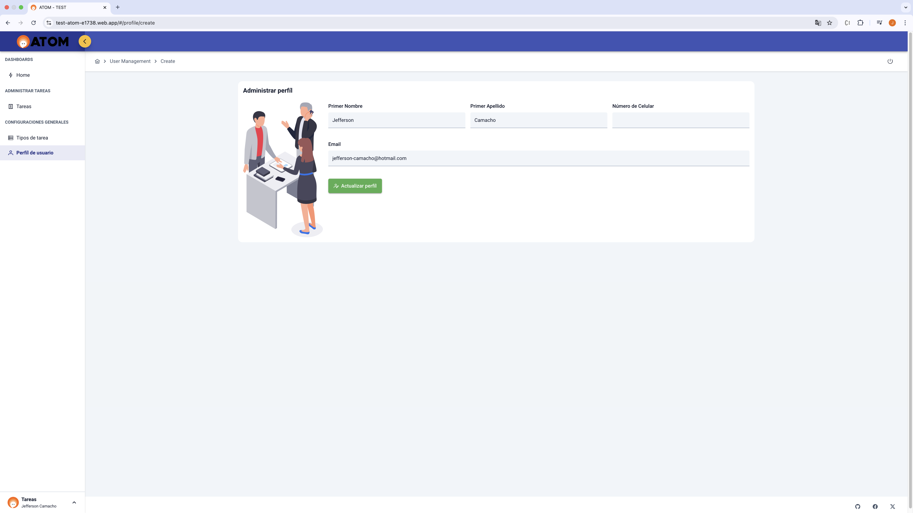

# Challenge Técnico - Aplicación de Gestión de Tareas (Backend)

## 📝 Descripción del proyecto
Este proyecto corresponde a un **challenge técnico** para el desarrollo de una aplicación de gestión de tareas. La aplicación consta de dos páginas principales:  
1. **Página de inicio de sesión**: Permite al usuario autenticarse usando solo su correo electrónico. Si el usuario existe, se navega a la página principal; en caso contrario, se solicita la confirmación para crear un nuevo usuario y, tras la creación, se redirige automáticamente a la página principal.  
2. **Página principal**: Muestra todas las tareas asignadas al usuario, ordenadas por fecha de creación, y permite agregarlas, editarlas, eliminarlas o cambiar su estado entre completado y pendiente.

El **backend** está desarrollado usando **Node.js**, **Express** y **Firebase**, aprovechando **Cloud Functions** para el despliegue en la nube y **Firebase Authentication** para la autenticación de usuarios. Los datos se almacenan en **Firestore**.

---

## ⚙️ Tecnologías utilizadas
- Node.js v22  
- Express  
- Firebase:  
  - Cloud Functions  
  - Firestore  
  - Authentication  
- Postman (para pruebas de endpoints)

---

## 🏗️ Estructura del proyecto

El backend está organizado en módulos/componentes para mantener un código limpio y escalable:

- **config**: Contiene la configuración general de la API, como conexión con la base de datos y variables de entorno.  
- **controllers**: Gestionan la lógica de cada endpoint y actúan como intermediarios entre las rutas y los servicios.  
- **services**: Contienen la lógica de negocio de la aplicación, interactuando directamente con la base de datos.  
- **middlewares**: Funciones intermedias que se ejecutan antes de los controladores, como autenticación o validaciones.  
- **routes**: Define los endpoints de la API y su asociación con los controladores correspondientes.  
- **utils**: Funciones genéricas reutilizables en toda la aplicación, como formateos de fechas o manejo de errores comunes.

---

## 📡 Endpoints principales

| Módulo      | Descripción |
|------------|-------------|
| **auth**      | Autenticar usuarios, restablecer contraseña y creación de usuarios en Firebase Authentication. |
| **users**     | Administración de usuarios de la plataforma. |
| **shoreKind** | Gestión de los diferentes tipos de tareas disponibles en la API para mejorar la organización. |
| **shore**     | Administración de tareas asignadas a los usuarios, incluyendo cambio de estado (COMPLETO, ACTIVO, INACTIVO, BLOQUEADO). |
| **config**    | Extrae configuraciones generales de la API desde la base de datos. |
| **health**    | Endpoint para validar la salud de la API. |

---

## 💾 Modelo de datos de las tareas

Cada tarea en la base de datos contiene los siguientes campos:

- `title` (string): Título de la tarea  
- `description` (string): Descripción detallada  
- `userId` (string): Usuario al que pertenece la tarea  
- `taskType` (string): Tipo de tarea (shoreKind)  
- `createdAt` (timestamp): Fecha de creación  
- `updatedAt` (timestamp): Fecha de última actualización  
- `status` (string): Estado de la tarea (`COMPLETO`, `ACTIVO`, `INACTIVO`, `BLOQUEADO`)

---

## ⚡ Instalación y despliegue

1. Clonar el repositorio:

    ```bash
    git clone <REPO_URL>
    cd <PROYECTO>

2. **Instalar dependencias:**
   ```bash
    npm install

3. **Desplegar en Firebase Cloud Functions:**
    ```bash
    firebase deploy --only functions

Nota: La API puede ejecutarse localmente para pruebas usando Firebase Emulator si se desea.

## 🌐 Pruebas
- Todas las rutas fueron probadas utilizando Postman, creando distintos entornos de prueba para garantizar el correcto funcionamiento de la API.
- 👉 https://test-atom-e1738.web.app/

## 🚀 Próximas mejoras

- Administración de usuarios por roles

- Almacenamiento de archivos (imágenes o documentos) en Firebase Storage

- Generación de reportes manuales o automáticos mediante CRON jobs

## 📸 Vista previa

|  |  |  |
|-----------------------------------------|-----------------------------------------|-----------------------------------------|

|  |  |  |
|-----------------------------------------|-----------------------------------------|-----------------------------------------|

## 👨‍💻 Autor
Jefferson Camacho Muñoz  
FullStack Developer

🔗 [LinkedIn](https://www.linkedin.com/in/jefferson-camacho-323b0b1ba/) ↗